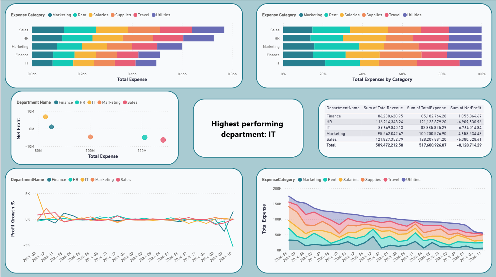
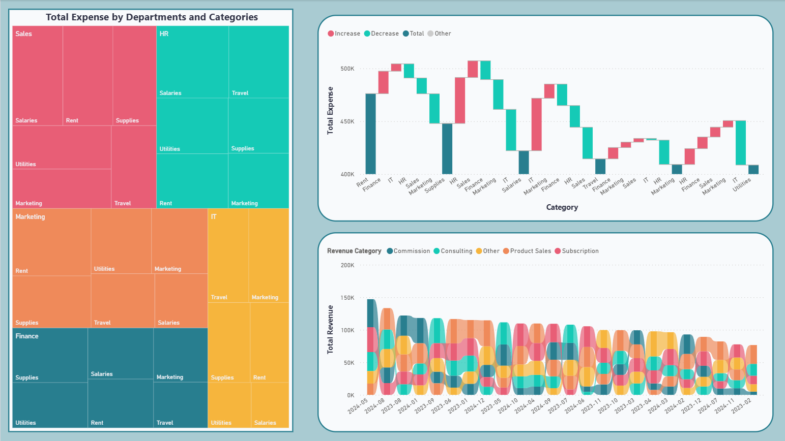

## Finance & Budget Analysis (SQL + Power BI)

### Project Overview
This project analyzes a company’s **financial performance** using **SQL Server** and **Power BI**.  
It focuses on understanding **revenues, expenses, and departmental efficiency**, helping management make data-driven financial decisions.

The workflow covers **data modeling**, **SQL view creation**, and **Power BI dashboard design** for KPI tracking and performance insights.

---

### Tools & Technologies
- **SQL Server** – Data modeling, querying, and KPI calculations  
- **Power BI** – Interactive dashboards with DAX measures  
- **Excel/CSV** – Source data imports  
- **DAX** – Profit growth metrics and conditional formatting

---

### Repository Structure

```bash
Finance-Analysis-Project/
│
├── data/
│   └── finance_data.csv
│
├── dashboard/
│   ├── Finance_Overview.pbix
│   ├── finance_overivew.png
│   └── department_analysis.png
│
├── tables.sql
├── views.sql
│
└── README.md
```

---

### Mapping Explanation

| Folder / File        | Description                                                                 |
|----------------------|-----------------------------------------------------------------------------|
| `data/`              | Contains raw financial data (revenues, expenses, departments, etc)          |
| `tables.sql`         | Script to create relational tables in SQL Server                            |
| `views.sql`          | Contains analytical SQL views for Power BI reporting                        |
| `dashboard/`         | Power BI report file (.pbix) and exported dashboard screenshots             |
| `README.md`          | Documentation explaining the project, workflow, and results                 |

---

### Example SQL View

```sql
-- vw_TopSpendingDepartments
CREATE VIEW vw_TopSpendingDepartments AS
SELECT
    Departments.DepartmentName,
    SUM(Expenses.Amount) AS TotalSpending,
    AVG(Expenses.Amount) AS AverageExpense,
    COUNT(Expenses.ExpenseID) AS ExpenseCount
FROM Departments
JOIN Expenses
    ON Departments.DepartmentID = Expenses.DepartmentID
GROUP BY Departments.DepartmentName
```
This view identifies departments with the highest total spending, helping management track efficiency and cost centers in Power BI.

---

## Power BI Dashboards

**1)**  Executive Summary
- Tracks **Total Revenue**, **Total Expenses**, and **Profit Growth %**.  
- Uses **DAX** to dynamically color positive (green) or negative (red) growth.

**2)**  Department Insights
- Highlights **Top Spending Departments** using bar and card visuals.  
- Provides a breakdown of **spending vs. allocated budget**.

**3)**  Trend Analysis
- Displays **Monthly Revenue Trends** and **Forecast Indicators** through line and scatter charts.

**Dashboard Samples:**
  


---

## Learning Outcomes
Through this project, I developed strong practical skills in:

- Designing normalized **SQL databases** for BI reporting  
- Creating reusable **analytical views** in SQL Server  
- Building **multi-page Power BI dashboards**  
- Applying **DAX measures** for performance KPIs

---

## Author

**Vishrut Gupta** 

